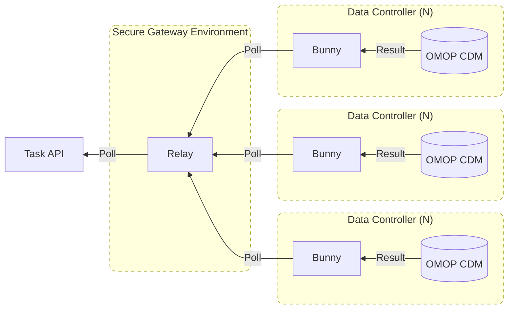

# Bunny

Bunny is an application for requesting cohort discovery queries and executing them against a OMOP database.

- Bunny is deployed in your local environment and makes only outgoing requests, which safely enables queries to be executed behind your firewall.
- Bunny can request queries from any compatible upstream Task API, such as BC|RQuest, or as part of a federated network through [Hutch Relay](/relay).
- Bunny enables [obfuscation](/bunny/config#obfuscation) of query results, to simplify data governance issues. 
- Bunny container images are available for ease of [deployment](/bunny/deployment) in your environment.
- Bunny can also be ran just as a query executor, through its [command line interface](/bunny/quickstart#running-bunny-cli).

