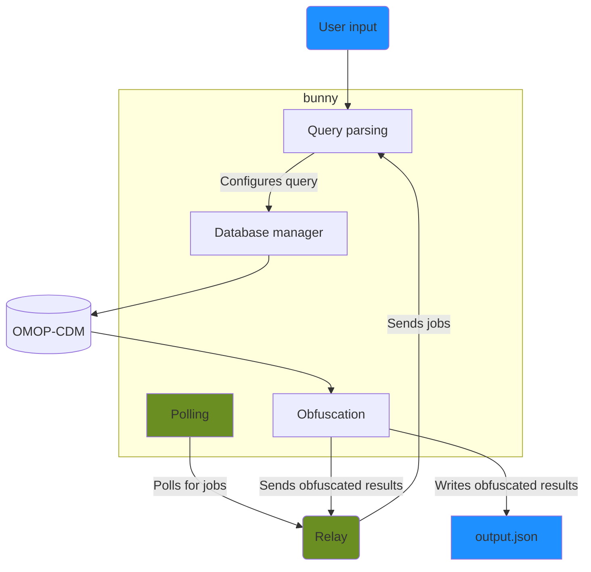

# Architecture

The same core components are used by the daemon and command-line interface (CLI).
CLI components are shown in blue, daemon components shown in green.

## bunny-daemon
The daemon initialises by

- Connecting to the database
- Starting the logger
- Initialising the Task API client
- Building the results modifiers
  - Reads the `LOW_NUMBER_SUPPRESSION_THRESHOLD` and `ROUNDING_TARGET` from settings
- Setting up the polling endpoint
  - Reads the `COLLECTION_ID` and `TASK_API_TYPE` from settings

### Polling
The daemon sends GET requests through the task API client until the task API endpoint sends a job.
It uses the JSON of the response body to execute a query.
If the query executes successfully, it tries to POST the result through the task API client five times.
After executing the query, it polls for jobs again.

The interval between polling requests is set through the `POLLING_INTERVAL` environment variable.

## Bunny core

The components used by the daemon and CLI are held in the `core` library. 

## bunny-cli
The CLI:

- Connects to the database
- Parses command-line arguments
- Builds the results modifiers
  - Reads the `LOW_NUMBER_SUPPRESSION_THRESHOLD` and `ROUNDING_TARGET` from settings

It then executes the query, and writes obfuscated results to a JSON file.

