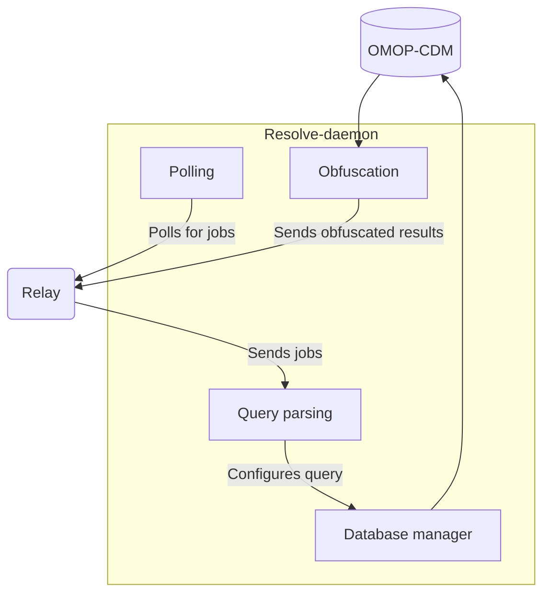
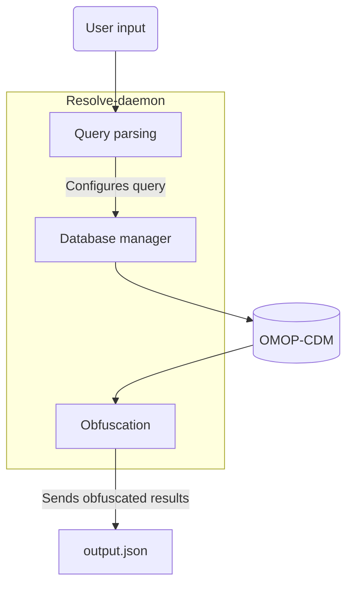

## Setting up Resolve for development

To make sure you have a working version of Resolve, follow the steps in the Quickstart. {/* Add the link when the quickstart branch has been merged */}

If the resolve-daemon logs messages saying that it's setting up a database connection, looking for and receiving jobs, and resolving queries, then it's working.
To double check, you can also use the resolve-cli to generate an output JSON.

### Using the environment
Resolve uses poetry to manage its dependencies.
To test any changes made to Resolve in development you can use either
```bash
poetry run resolve-[daemon/cli]
```
or start a poetry shell
```bash
poetry shell
resolve-[daemon/cli]
```

## Architecture

### resolve-daemon



### resolve-cli


