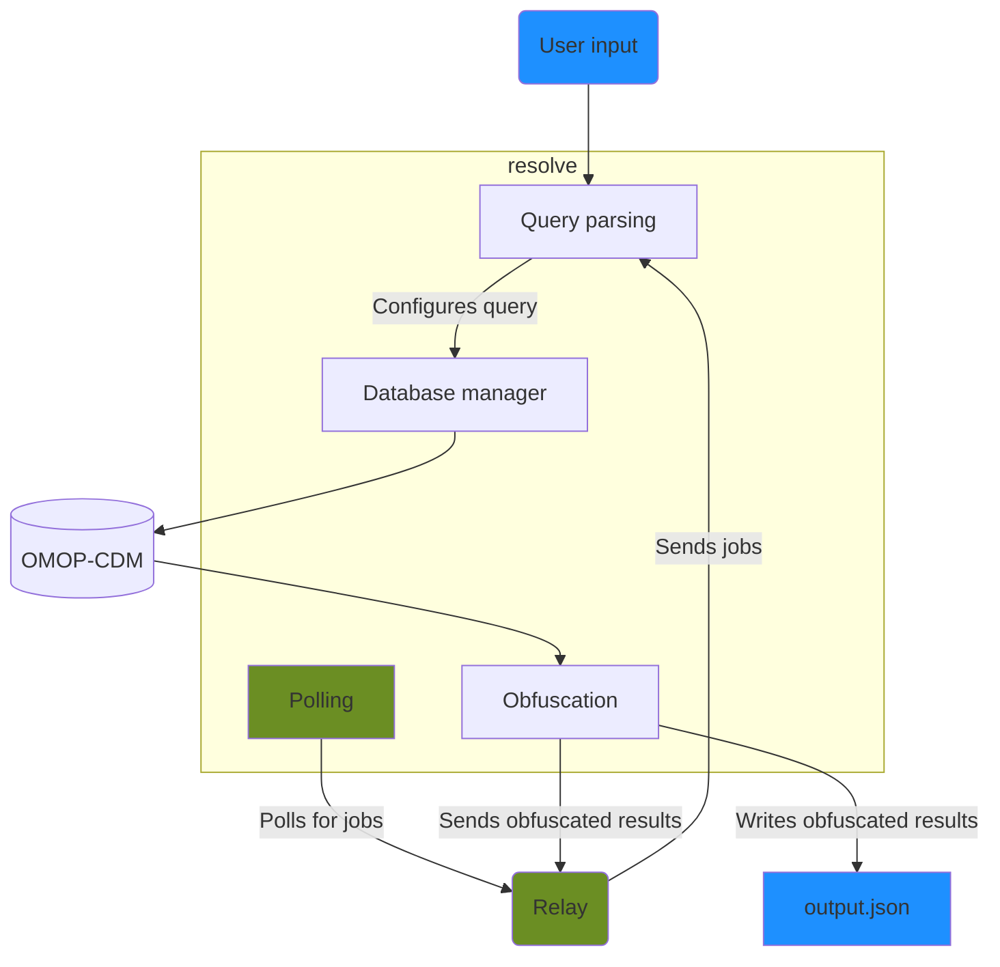

## Setting up Resolve for development

To make sure you have a working version of Resolve, follow the steps in the Quickstart. {/* Add the link when the quickstart branch has been merged */}

If the resolve-daemon logs messages saying that it's setting up a database connection, looking for and receiving jobs, and resolving queries, then it's working.
To double check, you can also use the resolve-cli to generate an output JSON.

### Using the environment
Resolve uses poetry to manage its dependencies.
To test any changes made to Resolve in development you can use either
```bash
poetry run resolve-[daemon/cli]
```
or start a poetry shell
```bash
poetry shell
resolve-[daemon/cli]
```

## Architecture

The same core components are used by the daemon and command-line interface (CLI).
CLI components are shown in blue, daemon components shown in green.




## resolve-daemon
The daemon initialises by

- [Connecting to the database](/resolve/core_api_ref/setting_database)
- Starting the [logger](/resolve/core_api_ref/logger)
- Initialising the [task API client](/resolve/core_api_ref/task_api_client)
- Building the [results modifiers](/resolve/core_api_ref/results_modifiers)
  - Reads the `LOW_NUMBER_SUPPRESSION_THRESHOLD` and `ROUNDING_TARGET` from [settings](/resolve/core_api_ref/settings)
- Setting up the polling endpoint
  - Reads the `COLLECTION_ID` and `TASK_API_TYPE` from [settings](#settings)

### Polling
The daemon sends GET requests through the [task API client](/resolve/core_api_ref/task_api_client) until the task API endpoint sends a job.
It uses the JSON of the response body to [execute a query](/resolve/core_api_ref/execute_query).
If the query executes successfully, it tries to POST the result through the [task API client](/resolve/core_api_ref/task_api_client) five times.
After executing the query, it polls for jobs again.

The interval between polling requests is set through the `POLLING_INTERVAL` environment variable.

## Resolve core

The components used by the daemon and CLI are held in the [`core`](/resolve/core_api_ref) library. 

## resolve-cli
The CLI:

- [Connects to the database](/resolve/core_api_ref/db_manager)
- [Parses command-line arguments](/resolve/core_api_ref/parser)
- Builds the [results modifiers](/resolve/core_api_ref/results_modifiers)
  - Reads the `LOW_NUMBER_SUPPRESSION_THRESHOLD` and `ROUNDING_TARGET` from [settings](/resolve/core_api_ref/settings)

It then [executes the query](/resolve/core_api_ref/execute_query), and writes [obfuscated](/resolve/core_api_ref/obfuscation) [results](/resolve/core_api_ref/rquest_dto/result) to a JSON file.

